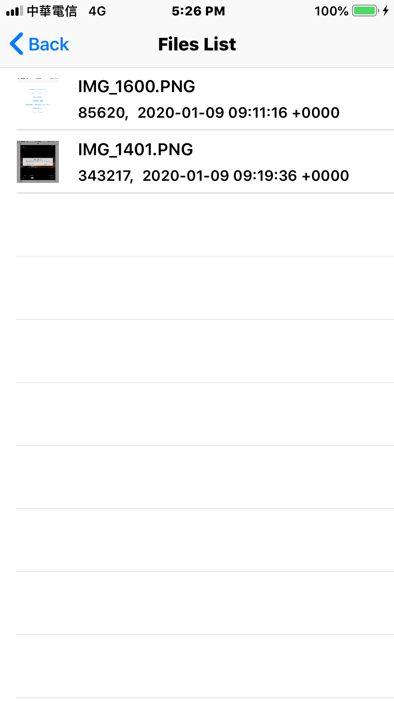
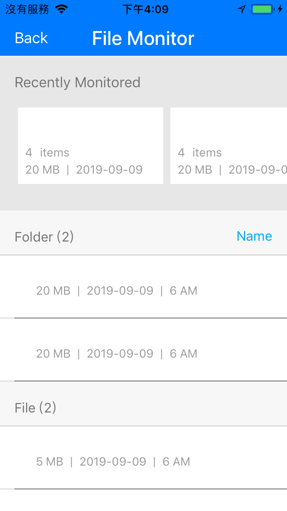

# IRCollectionTableViewModel 

- IRCollectionTableViewModel is a powerful MVVM Tableview/CollectionView for iOS, which is flexible and can easy to handle and reuse.

## Features
- MVVM structure.
- Flexible, Reusable.

## Install
### Git
- Git clone this project.
- Copy this project into your own project.
- Add the .xcodeproj into you  project and link it as embed framework.
#### Options
- You can remove the `demo` and `ScreenShots` folder.

### Cocoapods
- Add `pod 'IRCollectionTableViewModel'`  in the `Podfile`
- `pod install`

## Introduction MVVM

- Model--view--viewmodel (MVVM) is a software architectural pattern.
- It has advantages more than the tranditional MVC architectural. Can improve the whole code strurcture.
- More detail can see the MVVM wikipedia. [MVVM](https://en.wikipedia.org/wiki/Model–view–viewmodel)

## Usage

### Basic

#### TableView

- Create a new class `TableViewViewModel` extends `TableViewBasicViewModel<UITableViewDataSource>`, and Import `IRCollectionTableViewModel`
```obj-c
#import <IRCollectionTableViewModel/IRCollectionTableViewModel.h>

@interface TableViewViewModel : TableViewBasicViewModel<UITableViewDataSource>

@end
```

- You can add your init method and register the cell inside

```objc
- (instancetype)initWithTableView:(UITableView*)tableView;

...

- (instancetype)initWithTableView:(UITableView *)tableView {
    if (self = [super init]) {
        items = [[NSMutableArray<id<SectionModelItem>> alloc] init];
        
        [tableView registerNib:[UINib nibWithNibName:TableViewCell.identifier bundle:nil] forCellReuseIdentifier:TableViewCell.identifier];
    }
    return self;
}
```

- Add  `update` method
```objc
- (void)update;

...

- (void)update {
    [items removeAllObjects];
    // Setup items
}

```

- For setup `items`, other words, setup the sections/rows you want to show. Create `TableViewSectionItem`  and `TableViewRowItem`, `TableViewSectionType`
```objc
typedef NS_ENUM(NSInteger, ProfileRowType){
    RowType_DemoRow
};

@interface TableViewRowItem : RowBasicModelItem
@property (readonly) ProfileRowType type;
@end

implementation TableViewRowItem
@dynamic type;
@end

@interface TableViewSectionItem : SectionBasicModelItem
@property (nonatomic) NSString* sectionTitle;
@property (nonatomic) SectionType type;
@end

@implementation TableViewSectionItem
@end
```

- Setup `items`
```obj-c
- (void)setupRows {
    NSMutableArray *rowItems = [NSMutableArray array];
    [rowItems addObject:[[TableViewRowItem alloc] initWithType:RowType_DemoRow withTitle:@"Demo Row"]];
    [rowItems addObject:[[TableViewRowItem alloc] initWithType:RowType_DemoRow withTitle:@"Demo Row"]];
    
    NSArray *demoRowItems = [NSArray arrayWithArray:rowItems];
    TableViewSectionItem *item = [[TableViewSectionItem alloc] initWithRowCount:[demoRowItems count]];
    item.type = DemoSection;
    item.sectionTitle = @"Demo Section";
    item.rows = demoRowItems;
    [items addObject:item];
}
```

- Override `UITableViewDataSource`
```obj-c
#pragma mark - UITableViewDataSource
- (NSInteger)numberOfSectionsInTableView:(UITableView *)tableView {
    return items.count;
}

- (NSInteger)tableView:(nonnull UITableView *)tableView numberOfRowsInSection:(NSInteger)section {
    return [items[section] rowCount];
}

- (nonnull UITableViewCell *)tableView:(nonnull UITableView *)tableView cellForRowAtIndexPath:(nonnull NSIndexPath *)indexPath {
    id<SectionModelItem> item = [items objectAtIndex:indexPath.section];
    TableViewRowItem *row = (TableViewRowItem *)[item.rows objectAtIndex:[indexPath row]];
    
    switch (item.type) {
        case DemoSection:
        {
            switch (row.type) {
                case RowType_DemoRow:
                {
                    TableViewCell *cell = (TableViewCell *)[tableView dequeueReusableCellWithIdentifier:TableViewCell.identifier forIndexPath:indexPath];
                    cell.titleLabel.text = [NSString stringWithFormat:@"%@%ld", row.title, row.tagRange.location];
                    cell.editTextField.text = [editedTexts objectAtIndex:indexPath.row];
                    cell.editTextField.tag = row.tagRange.location;
                    cell.editTextField.delegate = self;
                    return cell;
                }
            }
            break;
        }
        default:
            break;
    }
    return [[UITableViewCell alloc] init];
}
```

- Use your view model `TableViewViewModel`
```objc
#import "TableViewViewModel.h"

@implementation TableViewController {
    TableViewViewModel *viewModel;
}

- (void)viewDidLoad {
    [super viewDidLoad];
    
    [self.tableView registerNib:[UINib nibWithNibName:TableViewHeaderView.identifier bundle:nil] forHeaderFooterViewReuseIdentifier:TableViewHeaderView.identifier];
    viewModel = [[TableViewViewModel alloc] initWithTableView:_tableView];
    _tableView.dataSource = viewModel;
    [viewModel update];
}

@end
```

#### CollectionView

- Just the same way of `TableViewViewModel`. Create a new class `CollectionBrowserViewModel` extends `TableViewBasicViewModel<UITableViewDataSource>`, and Import `IRCollectionTableViewModel`

- You can add your init method and register the cell inside

- For setup `items`, other words, setup the sections/rows you want to show. Create `CollectionBrowserSectionItem`  and `CollectionBrowserRowItem`, `CollectionBrowserSectionType`

- Override `UICollectionViewDataSource` 


### Advanced settings

#### Methos of TableViewBasicViewModel

- `TableViewBasicViewModel` provides some usage methods

```objc
- (NSInteger)getRowTypeWith:(SectionType)type row:(NSInteger)row;
- (NSString *)getSectionTitleinSection:(NSInteger)section;
- (UIImage *)getSectionLeftIconinSection:(NSInteger)section;
- (SectionType)getSectionTypeinSection:(NSInteger)section;
- (void)hideRows:(BOOL)hide inSection:(NSInteger)section;
- (BOOL)hiddenRowsinSection:(NSInteger)section;
- (NSIndexSet *)getIndexSetWithSectionType:(SectionType)sectionType;
- (NSIndexPath *)getIndexPathWithSectionType:(SectionType)sectionType rowType:(RowType)rowType;
- (void)setupRowTag;
- (NSIndexPath *)getIndexPathFromRowTag:(NSInteger)rowTag;
```
#### Tag

- Because the cells have reuse feature, somtimes we need to tag the cell/componenst if want to recognize the specific cell/components, thus  `IRCollectionTableViewModel` provides a tag feature

- Setup tags by `setupRowTag`, it save the tag information in the `tagRange` which is in the `RowBasicModelItem`
```objc
- (void)setupRows {
    ...
    
    [self setupRowTag];
}
```

- Get tag
```objc
TableViewRowItem *row = (TableViewRowItem *)[item.rows objectAtIndex:[indexPath row]];
tag = row.tagRange.location;
```

- Get indexPath by tag
```objc
- (NSIndexPath *)getIndexPathFromRowTag:(NSInteger)rowTag;
```

- Sometimes you want to tag the UI components like `UITextField`, use `setTagRangeLength`
```objc
TableViewRowItem *row = [[TableViewRowItem alloc] initWithType:RowType_DemoRow withTitle:@"Demo Row"];
[row setTagRangeLength:2];

...

[self setupRowTag];
```

- Then get tags
```objc
TableViewRowItem *row = (TableViewRowItem *)[item.rows objectAtIndex:[indexPath row]];
tag1 = row.tagRange.location;
tag2 = row.tagRange.location + 1;

cell.textField1.tag = tag1;
cell.textField2.tag = tag2;
```

- The tags are mapping to the same index path
```objc
[self getIndexPathFromRowTag:tag1] == [self getIndexPathFromRowTag:tag2]
```

Now, you can easy to tag anyhing you want.


#### Get Row Type

- Hide rows for specific setion by `(void)hideRows:(BOOL)hide inSection:(NSInteger)section`

```objc
- (NSInteger)getRowTypeWith:(SectionType)type row:(NSInteger)row;
```

#### Get Section Title

- Get section title which set in the `SectionBasicModelItem`

```objc
- (NSString *)getSectionTitleinSection:(NSInteger)section;
```

#### Get Section Left Icon

- Get section icon which set in the `SectionBasicModelItem`

```objc
- (UIImage *)getSectionLeftIconinSection:(NSInteger)section;
```

#### Get Section Type

- Get section type by section index

```objc
- (SectionType)getSectionTypeinSection:(NSInteger)section;
```

#### Hide Rows

- Hide rows for specific setion by `(void)hideRows:(BOOL)hide inSection:(NSInteger)section`
- Check hidden status by `(BOOL)hiddenRowsinSection:(NSInteger)section`

```objc
- (void)hideRows:(BOOL)hide inSection:(NSInteger)section;
- (BOOL)hiddenRowsinSection:(NSInteger)section;
```

#### Get Index Set

- Get index of section by section type

```objc
- (NSIndexSet *)getIndexSetWithSectionType:(SectionType)sectionType;
```

#### Get IndexPath

- Get index path by section type and row type

```objc
- (NSIndexPath *)getIndexPathWithSectionType:(SectionType)sectionType rowType:(RowType)rowType;
```


## Screenshots
| TableView | CollectionView |
|:---:|:---:|
||| 
