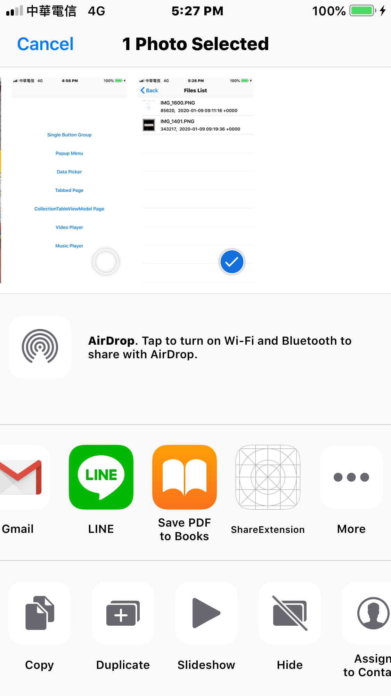

# IRShareManager 

- IRShareManager is a easy framework for deal with share files between the share extension and main app.

## Features
- Easy to share files into main app by Share Extension.

## Install
### Git
- Git clone this project.
- Copy this project into your own project.
- Add the .xcodeproj into you  project and link it as embed framework.
#### Options
- You can remove the `demo` and `ScreenShots` folder.

### Cocoapods
- Add `pod 'IRShareManager'`  in the `Podfile`
- `pod install`

## Usage

### Basic

#### Share Extension

- Create Share Extension, go to `Signing & Capabilities` > `+ Capability` > `App Groups` > Add a new group/group id

- Put codes into `ShareViewController.m`

```obj-c
...
#import <IRShareManager/IRShare.h>

@implementation ShareViewController

- (BOOL)isContentValid {
    ...
    [IRShare sharedInstance].groupID = YOUR_GROUP_ID;
    return YES;
}

- (void)didSelectPost {
    [[IRShare sharedInstance] showSaveAlertIn:self];
    [[IRShare sharedInstance] didSelectPostWith:self.extensionContext];
}

@end
```

#### Load Resources

- , go to `Signing & Capabilities` > `+ Capability` > `App Groups` > Choose a group/group id that the same of yo

- Load reseources which was shared by share extension in the main app

```obj-c
...
#import <IRShareManager/IRShare.h>

@implementation AppDelegate

- (BOOL)application:(UIApplication *)application didFinishLaunchingWithOptions:(NSDictionary *)launchOptions {
    ...
    [self saveImageIfExistInActionExtention];
    return YES;
}

- (void)applicationWillEnterForeground:(UIApplication *)application{
    NSLog(@"applicationWillEnterForeground");
    ...
    [self saveImageIfExistInActionExtention];
}

- (void)saveImageIfExistInActionExtention {
    [IRShare sharedInstance].groupID = YOUR_GROUP_ID;
    NSURL *directoryURL = [IRShare sharedInstance].directoryURL;
    
    NSFileManager *fileManager = [NSFileManager defaultManager];
    NSDirectoryEnumerator *enumerator = [fileManager
    enumeratorAtURL:directoryURL
    includingPropertiesForKeys:keys
    options:0
    errorHandler:^(NSURL *url, NSError *error) {
        // Handle the error.
        // Return YES if the enumeration should continue after the error.
        return YES;
    }];
    
    NSMutableArray *urlsToDelete = [[NSMutableArray alloc] init];
    for (NSURL *url in enumerator) {
        NSLog(@"url:%@", url);
        NSError *error;
        NSNumber *isDirectory = nil;
        if (! [url getResourceValue:&isDirectory forKey:NSURLIsDirectoryKey error:&error]) {
            // handle error
        }
        else if (! [isDirectory boolValue]) {
            [self saveImportFileIntoDB:url autoOpenFileWhileAPPapear:NO];
        }
        
        [urlsToDelete addObject:url];
    }
    
    for(NSURL *url in urlsToDelete){
        [[NSFileManager defaultManager] removeItemAtURL:url error:nil];
    }
}

@end
```

## Screenshots
| Share Extension | Files List |
|:---:|:---:|
||| 
